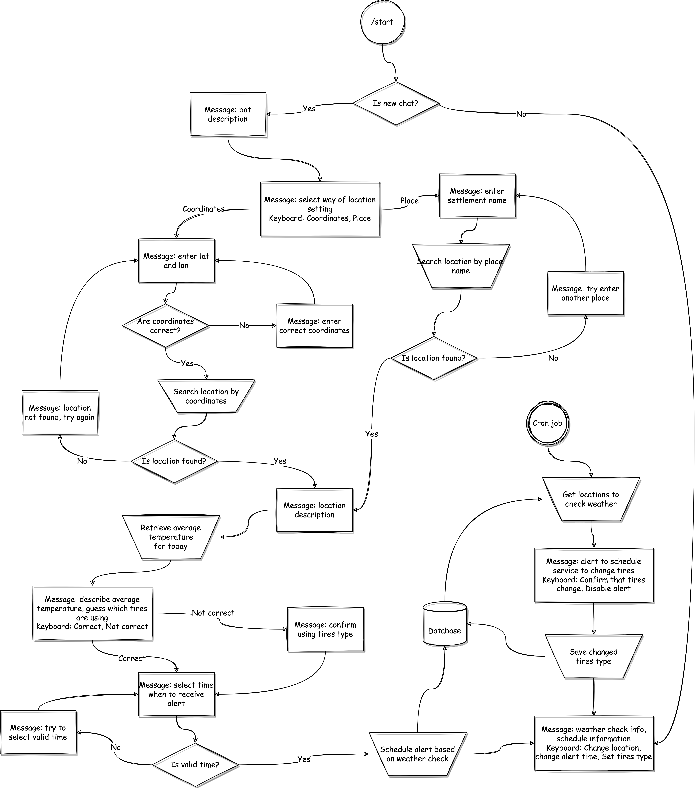

<<<<<<< HEAD
# movie_news_bot
=======
# TireTimeBot (@tire_time_bot)

## Main Idea

TireTimeBot is Telegram bot designed to help drivers stay safe on the road by providing timely reminders about when to change their tires from summer to winter and vice versa, based on the upcoming weather forecast.

### Features

- Automated Weather Monitoring: TireTimeBot tracks the weather forecast for the coming week in the user’s location to determine when conditions require winter or summer tires.
- Timely Notifications: Users receive a notification when it’s time to switch from summer tires to winter tires (and vice versa), giving them enough time to schedule a tire change.

## Workflow Diagram

>>>>>>> ee84eff (Add README.md)
